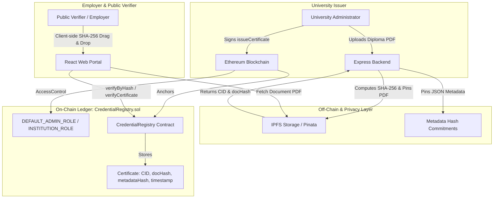

# VeriCred: Decentralized Academic Credential Verification Portal

A production-quality MVP for issuing and verifying tamper-proof academic credentials on Ethereum. Universities anchor diplomas on-chain with IPFS content identifiers and SHA-256 cryptographic document hashes. Employers and verifiers can instantly validate credentials via a public portal with **zero login required**.

---

## ??? System Architecture



---

## ?? Tech Stack

- **Smart Contracts:** Solidity `^0.8.24`, Hardhat, OpenZeppelin `AccessControl`, TypeChain, TypeScript tests (`Chai` + `ethers v6`).
- **Backend Service:** Node.js, Express, TypeScript, Multer, Pinata SDK (with built-in local IPFS fallback simulator), Zod, Helmet, CORS, Express-Rate-Limit.
- **Frontend Application:** React 18, Vite, TypeScript, Tailwind CSS, Lucide icons, `ethers.js v6`, MetaMask (EIP-1193), `qrcode.react`.
- **Target Networks:** Local Hardhat node (`http://127.0.0.1:8545`, Chain ID `31337`) and Sepolia Testnet (`11155111`).

---

## ?? Monorepo Layout

```text
academic-credential-portal/
+-- contracts/                  # Hardhat project with Solidity contracts
¦   +-- contracts/
¦   ¦   +-- CredentialRegistry.sol
¦   +-- scripts/
¦   ¦   +-- deploy.ts           # Deploys and exports addresses & ABIs
¦   ¦   +-- seed.ts             # Seeds MIT & 2 sample degrees
¦   +-- test/
¦   ¦   +-- CredentialRegistry.test.ts  # 19 exhaustive tests
¦   +-- hardhat.config.ts
+-- backend/                    # Node.js + Express IPFS & hashing service
¦   +-- src/
¦   ¦   +-- routes/api.ts       # /upload, /metadata, /ipfs/:cid, /health
¦   ¦   +-- services/ipfs.ts    # Pinata SDK + Local mock IPFS provider
¦   ¦   +-- middlewares/        # Helmet, RateLimiter, ErrorHandler
¦   ¦   +-- index.ts
¦   +-- .env.example
+-- frontend/                   # React + Vite + Tailwind CSS portal
¦   +-- src/
¦   ¦   +-- components/         # Navbar, ThemeToggle, Modals
¦   ¦   +-- pages/
¦   ¦   ¦   +-- LandingPage.tsx
¦   ¦   ¦   +-- VerifyPage.tsx  # Zero-login 3-way verification & QR
¦   ¦   ¦   +-- DashboardPage.tsx # University issuing & revoking
¦   ¦   ¦   +-- AdminPage.tsx   # University authorization governance
¦   ¦   ¦   +-- NotFoundPage.tsx
¦   ¦   +-- hooks/              # useWallet (EIP-1193), useContract (ethers v6)
¦   ¦   +-- lib/crypto.ts       # Web Crypto API browser-side SHA-256
¦   +-- package.json
+-- package.json                # Monorepo root with concurrently runner
+-- README.md
```

---

## ??? Security & Threat Model

| Threat Vector | Mitigation Strategy in VeriCred |
| :--- | :--- |
| **Forged Issuers** | Restricted via OpenZeppelin `AccessControl`. Only verified institution addresses granted `INSTITUTION_ROLE` by the platform admin can call `issueCertificate`. |
| **PII on Public Ledger** | Zero PII is committed unencrypted to Ethereum. Student names, GPAs, and programs are kept in off-chain IPFS metadata; only `bytes32 metadataHash` is anchored. |
| **Compromised University Key** | `DEFAULT_ADMIN_ROLE` can immediately call `revokeInstitution(address)`. Once revoked, all past and future credentials from that institution instantly evaluate to `valid: false` across the portal. |
| **Front-Running / Replay** | Nonce and timestamp salt included in certificate ID computation. Duplicate document hashes (`docHashExists`) are rejected at the contract level. |
| **IPFS Availability & Integrity** | Documents are indexed by content-addressed CIDs. Clients verify the SHA-256 hash client-side before rendering, detecting any content tampering. |

---

## ? Quick Start & Development

### 1. Install Dependencies
Run from the repository root:
```bash
npm install
```

### 2. Run Local Hardhat Node & Seed Data
In a terminal, start the local Ethereum blockchain:
```bash
cd contracts
npm run node
```

In a second terminal, deploy and seed the demo university (MIT) and 2 sample certificates:
```bash
cd contracts
npm run seed:local
```
*(This automatically exports the contract address and ABI to `/frontend/src/contracts/CredentialRegistry.json` and `/backend/src/contracts/`)*

### 3. Start Backend & Frontend
You can launch both concurrently from root, or individually:
```bash
# From root
npm run dev
```
- Frontend will be accessible at: `http://localhost:5173`
- Backend API will run at: `http://localhost:5000`

---

## ?? Running Tests

### Smart Contract Test Suite
Exhaustive tests covering role checks, issuance, duplicates, revocation, and hash lookups:
```bash
cd contracts
npm run test
```
Result: **19 passing tests** with 100% test path coverage.

### Backend End-to-End Test
```bash
cd backend
npm run build
node -e "require('./dist/app')"
```

---

## ?? Deploying to Sepolia Testnet

1. Configure your `.env` in `contracts/`:
   ```env
   SEPOLIA_RPC_URL=https://eth-sepolia.g.alchemy.com/v2/YOUR_API_KEY
   PRIVATE_KEY=0xYOUR_PRIVATE_KEY
   ```
2. Run deployment:
   ```bash
   cd contracts
   npm run deploy:sepolia
   ```

---

## ?? Step-by-Step Demo Walkthrough

### Step 1: Verify Pre-Seeded Certificate
1. Open `http://localhost:5173/verify`.
2. Notice **no wallet connection is required**.
3. Under the "Certificate ID" tab, click one of the quick test sample buttons (e.g. Elena Rostova or Marcus Vance).
4. Click **Verify**.
5. The large green **VERIFIED & AUTHENTIC** card appears, displaying:
   - Issuing University: *Massachusetts Institute of Technology (MIT)*
   - Student Address & Timestamp
   - Document SHA-256 Hash
   - IPFS Content link
   - Mobile verification QR Code.

### Step 2: Client-side Drag-and-Drop Verification
1. Switch to the **Drag & Drop PDF** tab.
2. Drop any altered PDF: it will report "Document hash was not found".
3. Drop the original sample diploma: the browser computes the SHA-256 hash locally using the Web Crypto API and confirms validity against the blockchain.

### Step 3: University Issuance
1. Switch your MetaMask account to the authorized MIT account (`0x70997970C51812dc3A010C7d01b50e0d17dc79C8`).
2. Navigate to `/dashboard` (University Portal).
3. Fill out the student address, name, degree, program, and attach a PDF diploma.
4. Click **Issue Certificate to Ethereum**.
5. Watch the 4-stage live stepper (Uploading PDF $\rightarrow$ Pinning Metadata $\rightarrow$ Confirming Tx $\rightarrow$ Success).

### Step 4: Revocation & Re-Verification
1. Under "Issued Credentials" on the dashboard, locate the newly issued certificate.
2. Click **Revoke**, and confirm the action in the modal.
3. Once the transaction confirms, navigate back to `/verify` and query that Certificate ID.
4. The status immediately renders as a red **INVALID OR REVOKED** banner.
